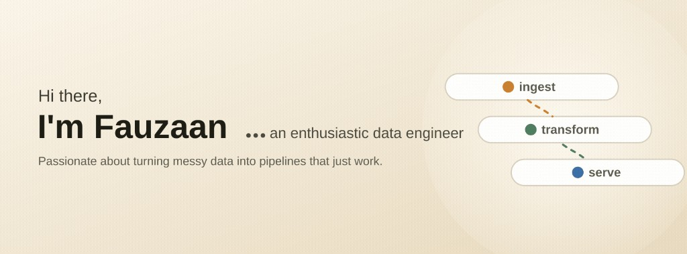
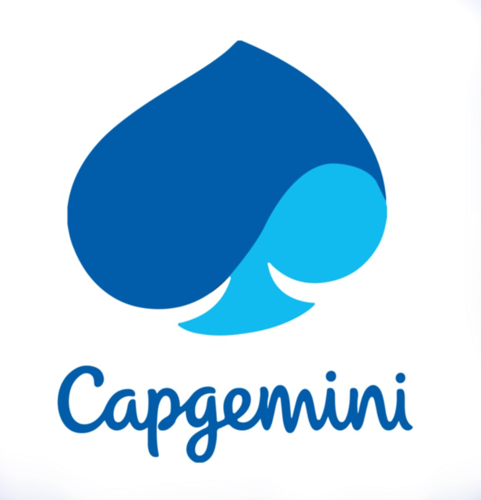

# About Me:

💼 **Currently:** Data Engineer at **Hotkeys Solutions** (Baltimore, MD) — healthcare claims, lakehouse, and governance at scale.

🎓 **Education:** M.S. Computer Science, **UMBC** (GPA 3.9/4.0) · B.Tech, IIIT Jabalpur.

💻 **Focus:** Python, SQL, Spark, Kafka, Airflow, and dbt — building ETL/ELT pipelines and cloud data platforms on **AWS** and **GCP**.

🔧 **What I care about:** data quality, observability, cost optimization, and audit-ready pipelines for regulated workloads.

## Work Experience:

<table>
<tr>
<td width="150" valign="middle" align="center">

</td>
<td valign="top">
<b>Data Engineer | Baltimore, MD</b> 
<ul>
<li>Optimized Spark on Databricks for <b>5TB+ daily</b> claims via partitioning, join tuning, and skew fixes.</li>
<li>Built metadata-driven DataOps across <b>7+ Airflow workflows</b> with Git CI/CD, saving <b>~15 hrs/week</b> on reruns.</li>
<li>Contributed to <b>Delta Lake</b> on S3 (Terraform), cutting analytics queries from <b>20 min → &lt;45 sec</b>.</li>
<li>Implemented observability for <b>3M+ transactions</b> with Python + CloudWatch (Docker) to catch drift early.</li>
<li>Enforced Snowflake governance (RBAC, dbt contracts), reducing audit response time by <b>60%</b>.</li>
</ul>
</td>
</tr>
</table>
 

<table>
<tr>
<td width="150" valign="middle" align="center">

</td>
<td valign="top">
<b>Data Engineer | Hyderabad, India</b> 
<ul>
<li>Built AML monitoring with Python, SQL, and <b>Great Expectations</b> validating <b>5M+ daily</b> financial records.</li>
<li>Developed <b>Kafka + Spark Streaming</b> pipelines meeting a <b>5-minute</b> fraud-decisioning SLA.</li>
<li>Sustained <b>99.9% uptime</b> on legacy ingestion (SFTP, REST, flat files → Redshift/DynamoDB).</li>
<li>Migrated HiveQL batch jobs to <b>AWS Glue</b> + Athena with Power BI dashboards for stakeholders.</li>
<li>Cut cloud spend <b>25% (~$30K/yr)</b> via Redshift right-sizing and Glue/Lambda tuning.</li>
</ul>
</td>
</tr>
</table>
 

<table>
<tr>
<td width="150" valign="middle" align="center">

</td>
<td valign="top">
<b>Graduate Research Assistant | Baltimore, MD</b> 
<ul>
<li>Orchestrated preprocessing for a <b>52K+ image</b> traffic-sign dataset — structuring ingestion, label-based organization, and batch transforms to standardize inputs for CNN training.</li>
<li>Built idempotent Python ingestion for <b>150+ weekly</b> student submissions into <b>BigQuery</b>, cutting data prep from <b>4 hrs → 20 min</b> per cycle for exploratory querying.</li>
<li>Standardized ingestion with <b>8 reusable ETL modules</b> (<b>90%+ Pytest</b> coverage), reducing pipeline failures <b>35%</b>.</li>
</ul>
</td>
</tr>
</table>
 

<table>
<tr>
<td width="150" valign="middle" align="center">

</td>
<td valign="top">
<b>Data Science & Analytics Engineer | Rourkela, India</b> 
<ul>
<li>Designed end-to-end defect prediction workflow — scraping public repos, routing data through multi-stage processing, and feeding an Adaptive Weighted Average Ensemble model.</li>
<li>Automated cleaning and feature engineering with Python, Pandas, and SQL via cron-scheduled jobs, applying normalization and recursive feature elimination to cut dimensionality <b>31%</b>.</li>
</ul>
</td>
</tr>
</table>

 

### Languages :

  <table>
    <tr>
      <td align="center" width="88">
        
         Python
      </td>
      <td align="center" width="88">
        
         SQL
      </td>
      <td align="center" width="88">
        
         Scala
      </td>
      <td align="center" width="88">
        
         Shell
      </td>
      <td align="center" width="88">
        
         Pandas
      </td>
      <td align="center" width="88">
        
         NumPy
      </td>
      <td align="center" width="88">
        
         scikit-learn
      </td>
      <td align="center" width="88">
        
         Streamlit
      </td>
    </tr>
  </table>

 

### Cloud :

  <table>
    <tr>
      <td align="center" width="88">
        
         AWS
      </td>
      <td align="center" width="88">
        
         GCP
      </td>
      <td align="center" width="88">
        
         BigQuery
      </td>
    </tr>
  </table>

 

### Data Storage :

  <table>
    <tr>
      <td align="center" width="88">
        
         PostgreSQL
      </td>
      <td align="center" width="88">
        
         MySQL
      </td>
      <td align="center" width="88">
        
         Redis
      </td>
      <td align="center" width="88">
        
         Snowflake
      </td>
      <td align="center" width="88">
        
         DynamoDB
      </td>
      <td align="center" width="88">
        
         Delta Lake
      </td>
      <td align="center" width="88">
        
         Databricks
      </td>
      <td align="center" width="88">
        
         HDFS
      </td>
    </tr>
  </table>

 

### Distributed Systems :

  <table>
    <tr>
      <td align="center" width="88">
        
         Spark
      </td>
      <td align="center" width="88">
        
         Kafka
      </td>
      <td align="center" width="88">
        
         Flink
      </td>
      <td align="center" width="88">
        
         Hive
      </td>
    </tr>
  </table>

 

### ETL & Orchestration :

  <table>
    <tr>
      <td align="center" width="88">
        
         Airflow
      </td>
      <td align="center" width="88">
        
         dbt
      </td>
      <td align="center" width="88">
        
         Dagster
      </td>
      <td align="center" width="88">
        
         Pytest
      </td>
    </tr>
  </table>

 

### DevOps & BI :

  <table>
    <tr>
      <td align="center" width="88">
        
         Git
      </td>
      <td align="center" width="88">
        
         Docker
      </td>
      <td align="center" width="88">
        
         Kubernetes
      </td>
      <td align="center" width="88">
        
         Terraform
      </td>
      <td align="center" width="88">
        
         GitHub Actions
      </td>
      <td align="center" width="88">
        
         Power BI
      </td>
      <td align="center" width="88">
        
         Looker
      </td>
    </tr>
  </table>

 

### GitHub Stats :

  

  

 

### How to reach me :

  <table>
    <tr>
      <td align="center" width="140">
        <a href="mailto:fauzaanmd98@gmail.com">
          
           <b>Email</b>
           fauzaanmd98@gmail.com
        </a>
      </td>
      <td align="center" width="140">
        <a href="https://www.linkedin.com/in/fauzaanmd/">
          
           <b>LinkedIn</b>
           fauzaanmd
        </a>
      </td>
      <td align="center" width="140">
        <a href="https://github.com/FauzaanAhmed">
          
           <b>GitHub</b>
           FauzaanAhmed
        </a>
      </td>
    </tr>
  </table>

